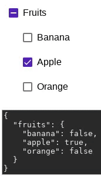

# Angular Material Checklist

`mat-checklist` brings together several checkboxes from `@angular/material` to make a checklist. This also allows checkboxes nesting:

### Installing

`npm install @maarti/mat-checklist`

## Running unit tests

Run `ng test` to execute the unit tests via [Karma](https://karma-runner.github.io).

## Running end-to-end tests

Run `ng e2e` to execute the end-to-end tests via [Protractor](http://www.protractortest.org/).

## Built With

* [Angular](https://angular.io/) - The web framework used
* [Angular Material](https://material.angular.io/) - Material Design components for Angular

## Contributing

1. Clone the repo: `git clone https://github.com/Maarti/AngularMaterialChecklist.git`
2. Install packages : `npm install`
3. Add your contribution
4. [Submit a pull request](https://github.com/Maarti/AngularMaterialChecklist/pull/new/master)

## Authors

[Bryan MARTINET](https://maarti.net/)

See also the list of [contributors](https://github.com/Maarti/AngularMaterialChecklist/graphs/contributors) who participated in this project.

## License

This project is licensed under the MIT License - see the [LICENSE.md](LICENSE.md) file for details
